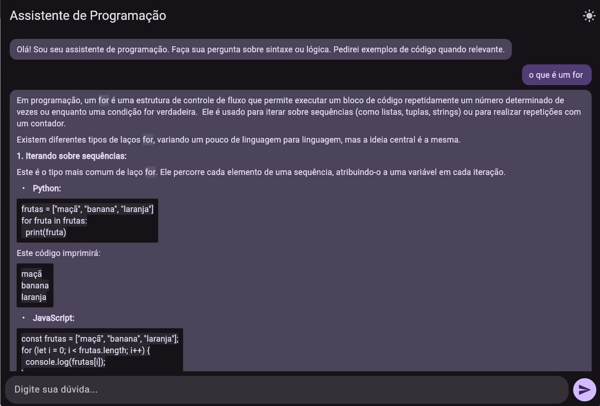
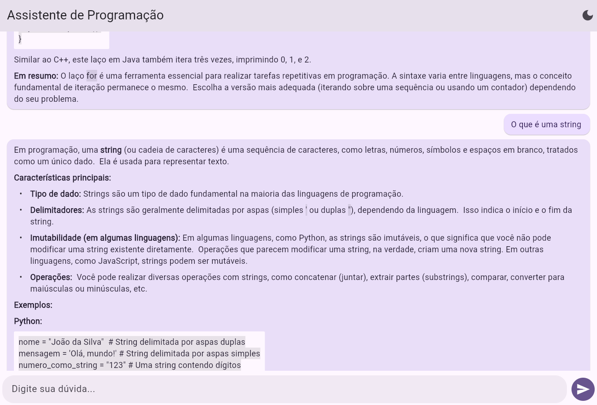

# llm_assistente_programacao

## Descrição do App

O llm_assistente_programacao é um assistente de programação multiplataforma desenvolvido em Flutter. Ele utiliza um modelo de linguagem (LLM) para responder dúvidas, sugerir códigos e auxiliar desenvolvedores em tempo real, com interface moderna e suporte a temas claro/escuro.

## Imagens do App




## Tecnologias Utilizadas

- **Flutter** (Dart)
- **flutter_markdown** (renderização de Markdown)
- **http** (requisições HTTP)
- **flutter_dotenv** (variáveis de ambiente)
- **markdown** (parsing de Markdown)
- **LLM API** (integração com modelo de linguagem)

## Instruções de Instalação e Execução

1. Instale o [Flutter](https://docs.flutter.dev/get-started/install).
2. Clone este repositório:
   ```sh
   git clone https://github.com/arthurgnoronha/llm_assistente_programacao
   cd llm_assistente_programacao

3. Instale as dependências:
```sh
flutter pub get
```

4. Crie um arquivo .env seguindo o .env.example.

5. Rode o app utilizando
```sh
flutter run -d chrome
```
(substitua chrome pela plataforma desejada)

## Como o LLM foi Utilizado
O app se comunica com uma API de LLM (Large Language Model) para processar perguntas dos usuários e retornar respostas inteligentes. As mensagens são enviadas via HTTP para o endpoint do modelo, e as respostas são exibidas em formato Markdown na interface do app. Isso permite que o usuário obtenha explicações, exemplos de código e sugestões diretamente do modelo de linguagem.

**Autor:** Arthur Noronha